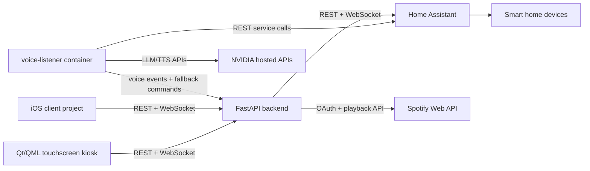

# Vokrr

Vokrr is a local-first smart home console for a Raspberry Pi. It combines Home Assistant for device integration, a FastAPI backend for authentication and orchestration, a native Qt/QML touchscreen UI, Spotify playback controls, and a wake-word voice pipeline using Porcupine, faster-whisper, NVIDIA Llama, and NVIDIA Magpie TTS.

The current target device is a Raspberry Pi 4B with the official 7-inch DSI touchscreen running a fullscreen kiosk.

## What Vokrr Does

- Shows the GT dashboard, room controls, health, Jarvis, and settings in a native 800x480 touchscreen UI.
- Controls Home Assistant entities through a Vokrr backend instead of calling Home Assistant directly from clients.
- Imports discovered Home Assistant entities into a local device registry.
- Keeps device states fresh through Home Assistant REST/WebSocket updates and periodic reconciliation.
- Supports local kiosk login plus username/password app login with JWT access tokens and refresh tokens.
- Provides voice control with wake word `Jarvis`, local STT, NVIDIA LLM classification, Home Assistant service calls, and Magpie TTS replies.
- Provides Spotify OAuth/playback controls and a Spotify Connect container named `Vokrr`.
- Supports optional Cloudflare Tunnel exposure for the backend only.

## Current Architecture



More detail lives in [docs/ARCHITECTURE.md](docs/ARCHITECTURE.md).

## Supported Platforms

| Component | Supported target |
| --- | --- |
| Production host | Raspberry Pi 4B / 8GB |
| OS | Raspberry Pi OS 64-bit with desktop/lightdm for kiosk |
| Display | Official Raspberry Pi 7-inch DSI touchscreen, 800x480 |
| Backend and services | Docker Compose with host networking |
| UI | Native Qt 6 Quick/QML |
| Development | Linux/macOS for backend docs/tests; Raspberry Pi or Linux with Qt 6 for kiosk |
| iOS client | Generated Xcode project under `ios/Vokrr` |

## Touchscreen UI

The kiosk uses a fixed 800x480 design surface that scales uniformly inside the available fullscreen viewport. It contains Dashboard, Rooms, Health, Jarvis, and Settings screens. Room detail supports optimistic on/off updates plus brightness, RGB color, and color-temperature controls when Home Assistant exposes those capabilities.

## Quick Start

```bash
git clone <repo-url> Vokrr
cd Vokrr
cp .env.example .env
cp .env.example scripts/.env
```

Edit `.env` and `scripts/.env`:

- Set `HOME_ASSISTANT_TOKEN`.
- Set `UH_TOKEN` for Ultrahuman Personal API access. For legacy partner credentials, also set `UH_ACCOUNT`.
- Set `APP_BOOTSTRAP_ADMIN_USERNAME`, `APP_BOOTSTRAP_ADMIN_PASSWORD`, and `APP_AUTH_SECRET`.
- Set `PORCUPINE_API_KEY` if voice is enabled.
- Set `NVIDIA_API_KEY` or `NVIDIA_BUILD_API_KEY` if the NVIDIA voice pipeline is enabled.

Start the service stack:

```bash
docker compose -f infra/docker-compose.yml up -d --build
```

Build the native kiosk:

```bash
cmake -S qt-frontend -B qt-frontend/build -G Ninja -DCMAKE_BUILD_TYPE=Release
cmake --build qt-frontend/build
```

Run the kiosk manually:

```bash
VOKRR_QT_WINDOWED=1 VOKRR_API_BASE=http://localhost:8080 qt-frontend/build/vokrr-qt
```

Open service URLs:

- Backend API docs: `http://localhost:8080/docs`
- Backend health: `http://localhost:8080/api/system/health`
- Authenticated Ultrahuman dashboard: `http://localhost:8080/api/health/dashboard`
- Home Assistant: `http://localhost:8123`
- Voice listener health: `http://localhost:8091/health`

## Full Installation

Use the complete guide for a clean Raspberry Pi build:

- [docs/INSTALLATION.md](docs/INSTALLATION.md)
- [docs/HARDWARE.md](docs/HARDWARE.md)
- [docs/ENVIRONMENT.md](docs/ENVIRONMENT.md)

Short production setup:

```bash
sudo PI_USER=$USER ./scripts/phase0_setup.sh
sudo reboot
```

After reboot:

```bash
docker compose -f infra/docker-compose.yml up -d --build
cmake -S qt-frontend -B qt-frontend/build -G Ninja -DCMAKE_BUILD_TYPE=Release
cmake --build qt-frontend/build
sudo ./scripts/install_wifi_service.sh
sudo systemctl enable --now vokrr-stack.service
sudo systemctl enable --now vokrr-kiosk.service
```

The current systemd units contain absolute paths for `/home/dushyant/apps/Vokrr`. If installing under a different path or user, update the unit files first.

## Development

Backend:

```bash
cd backend
python3 -m venv .venv
. .venv/bin/activate
pip install -e ".[dev]"
uvicorn app.main:app --reload --host 0.0.0.0 --port 8080
```

Tests:

```bash
cd backend
. .venv/bin/activate
python -m pytest
```

Qt/QML:

```bash
cmake -S qt-frontend -B qt-frontend/build -G Ninja -DCMAKE_BUILD_TYPE=Debug
cmake --build qt-frontend/build
VOKRR_QT_WINDOWED=1 VOKRR_API_BASE=http://localhost:8080 qt-frontend/build/vokrr-qt
```

Set `VOKRR_REDUCED_MOTION=1` to disable interface transitions. For local visual regression checks with PySide6 installed:

```bash
QT_QPA_PLATFORM=offscreen python qt-frontend/tests/render_shell.py
QT_QPA_PLATFORM=offscreen python qt-frontend/tests/smoke_shell.py
```

Voice pipeline CLI test:

```bash
docker compose run --rm --no-deps voice-listener \
  python -m services.voice_pipeline --text "turn on bedroom lights" --no-speak
```

## Production / Kiosk Mode

Production uses:

- `vokrr-wifi.service` to configure primary/secondary Wi-Fi through NetworkManager.
- `vokrr-stack.service` to start Docker Compose with the Cloudflare profile.
- `vokrr-kiosk.service` to launch the Qt kiosk after the graphical session and backend are available.

Useful commands:

```bash
sudo systemctl status vokrr-wifi.service --no-pager
sudo systemctl status vokrr-stack.service --no-pager
sudo systemctl status vokrr-kiosk.service --no-pager
journalctl -u vokrr-kiosk.service -b --no-pager
docker compose -f infra/docker-compose.yml ps
```

## Environment Variables

`.env.example` is the canonical template. Full documentation is in [docs/ENVIRONMENT.md](docs/ENVIRONMENT.md).

Security notes:

- Never commit `.env`, `scripts/.env`, Home Assistant tokens, Spotify tokens, NVIDIA keys, or Cloudflare tokens.
- Ultrahuman credentials remain in the backend environment; the Qt client only receives normalized metrics.
- `backend/data/` contains runtime databases and OAuth tokens.
- Expose only the backend through Cloudflare Tunnel. Do not expose Home Assistant directly.

## Documentation

- [Hardware](docs/HARDWARE.md)
- [Software stack](docs/SOFTWARE_STACK.md)
- [Installation](docs/INSTALLATION.md)
- [User guide](docs/USER_GUIDE.md)
- [Developer guide](docs/DEVELOPER_GUIDE.md)
- [Architecture](docs/ARCHITECTURE.md)
- [Environment](docs/ENVIRONMENT.md)
- [Troubleshooting](docs/TROUBLESHOOTING.md)
- [Cloudflare Tunnel](docs/deployment/cloudflare-tunnel.md)
- [Home Assistant setup](docs/setup/home-assistant.md)
- [Ultrahuman setup](docs/setup/ultrahuman.md)
- [iOS app notes](docs/setup/ios-app.md)

## Troubleshooting

Run the project health check:

```bash
scripts/health_check.sh
```

Common checks:

```bash
curl -sS http://localhost:8080/api/system/health
curl -sS http://localhost:8091/health
docker compose -f infra/docker-compose.yml logs --tail=100 backend
docker compose -f infra/docker-compose.yml logs --tail=100 voice-listener
journalctl -u vokrr-kiosk.service -b --no-pager
```

For detailed fixes, see [docs/TROUBLESHOOTING.md](docs/TROUBLESHOOTING.md).

## Maintenance Notes

- Rebuild containers after Python/service changes:
  ```bash
  docker compose -f infra/docker-compose.yml up -d --build backend voice-listener
  ```
- Rebuild the kiosk after QML/C++ changes:
  ```bash
  cmake --build qt-frontend/build
  sudo systemctl restart vokrr-kiosk.service
  ```
- Restart audio-dependent services after audio hardware changes:
  ```bash
  scripts/restart_audio_stack.sh
  ```
- Refresh imported HA devices from the UI or:
  ```bash
  curl -X POST http://localhost:8080/api/devices/refresh \
    -H "Authorization: Bearer $ACCESS_TOKEN"
  ```

## Manual Verification Checklist

- Backend health returns `ok: true`.
- Home Assistant UI opens and the token can read `/api/states`.
- Qt kiosk starts fullscreen and touch input maps correctly.
- Dashboard, Rooms, Health, Jarvis, and Settings stay within the 800x480 viewport.
- Device toggles update Home Assistant and return to the UI through WebSocket events.
- Light brightness and selected RGB/color temperature are reflected immediately and reconcile with Home Assistant.
- Restarting the backend performs the initial HA state sync.
- Voice listener reports `waiting for wake-word`, wakes on `Jarvis`, listens for one command for up to 10 seconds, then resets.
