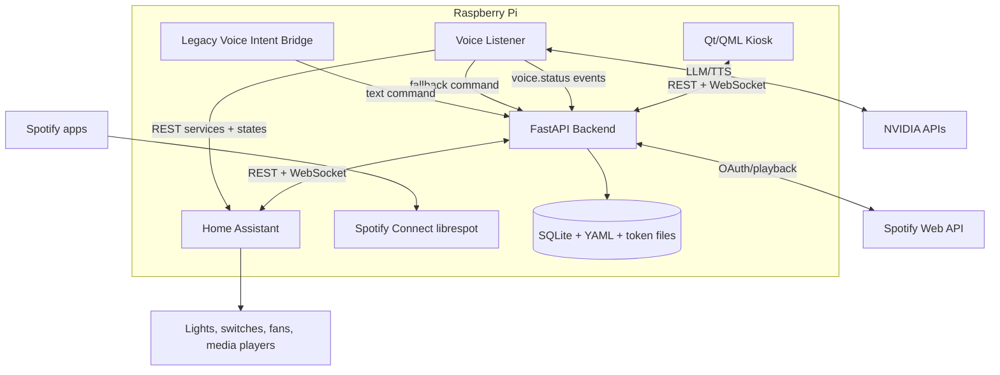
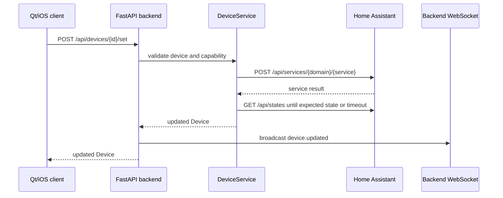
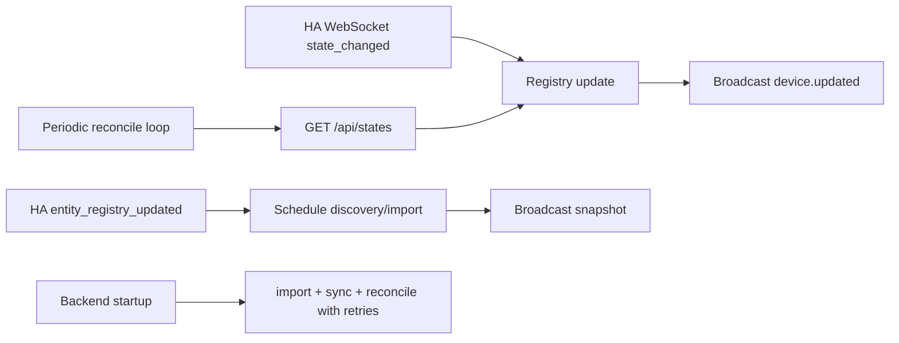
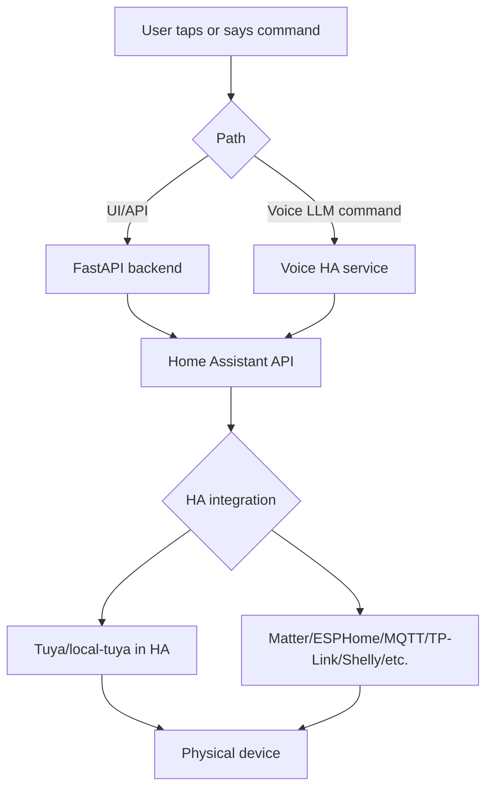
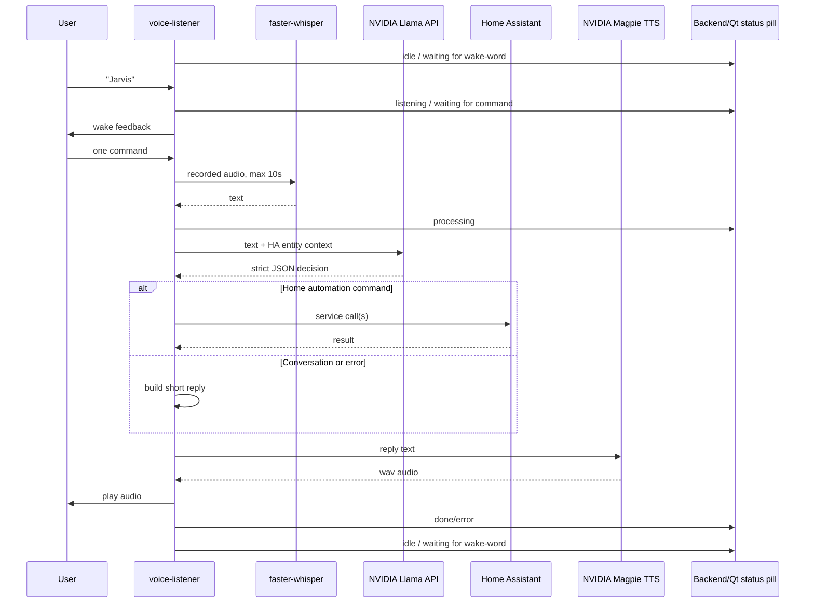
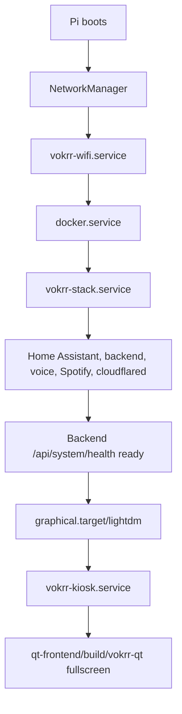

# Architecture

Vokrr is a local-first home automation console. Home Assistant is the integration engine; Vokrr owns the custom UI, auth, orchestration, voice UX, and device presentation.

## High-Level System

## Device Control Flow

## State Sync Flow

## Home Assistant vs Tuya Routing

Current implementation note: Vokrr does not call Tuya cloud APIs directly. Tuya devices must be exposed through Home Assistant.

## Voice Pipeline

## Raspberry Pi Boot/Startup Flow

## Persistence

| Path | Purpose |
| --- | --- |
| `home-assistant/config/` | Home Assistant configuration and Vokrr YAML registry |
| `backend/data/auth.db` | Vokrr users, sessions, activity |
| `backend/data/onboarding.db` | Imported Home Assistant devices |
| `backend/data/spotify_tokens.json` | Spotify OAuth tokens |
| `backend/data/audio-output.env` | Detected ALSA playback device |
| `backend/data/librespot-*` | Spotify Connect cache |

